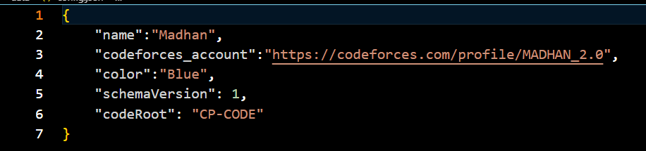
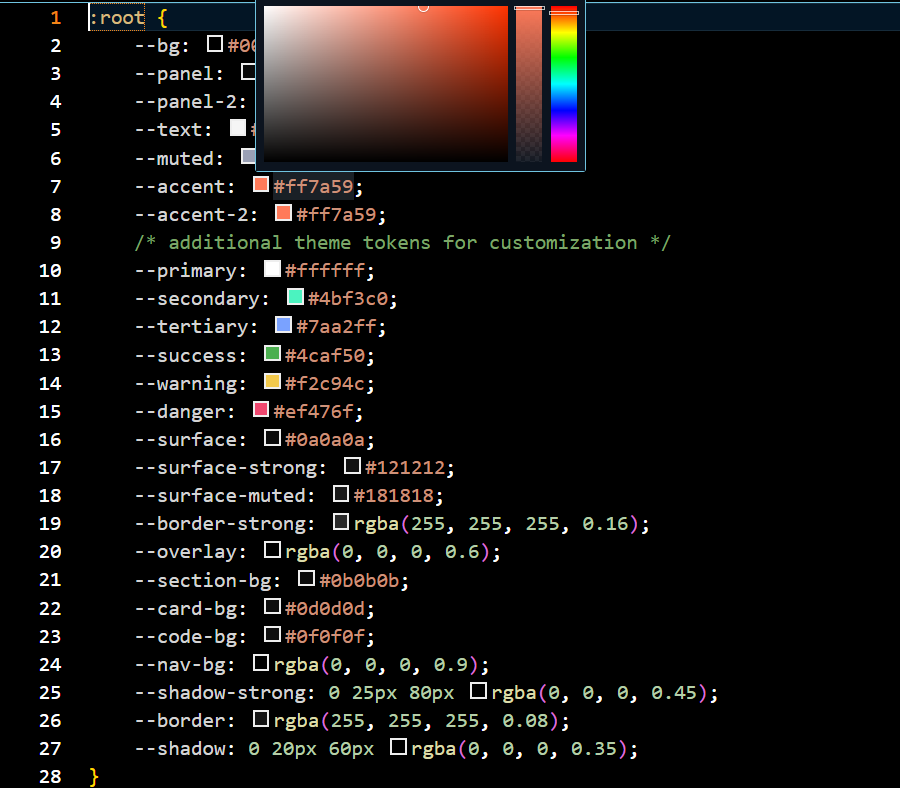
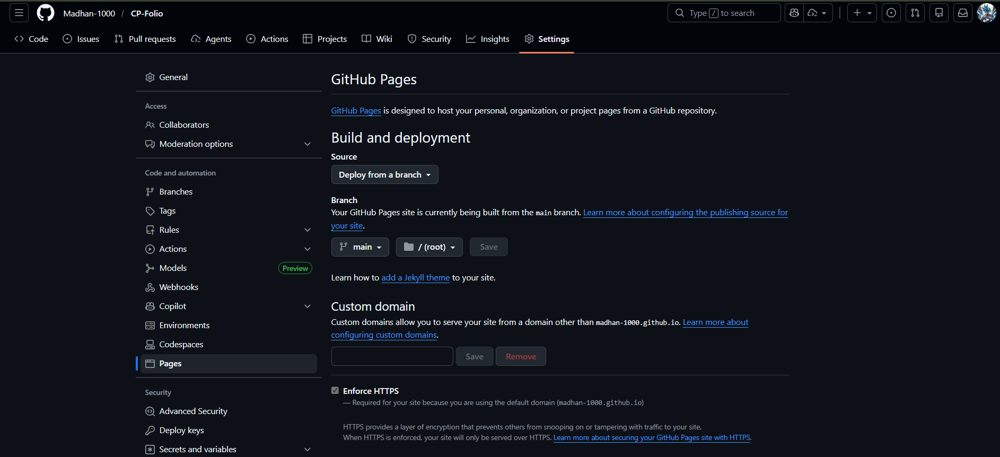
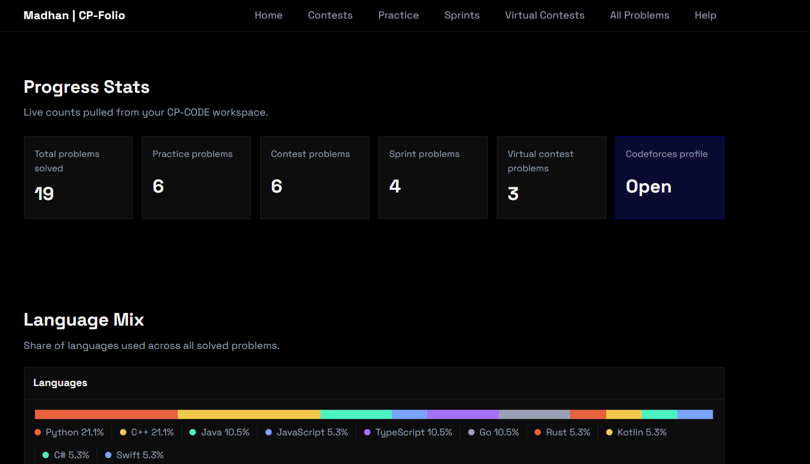
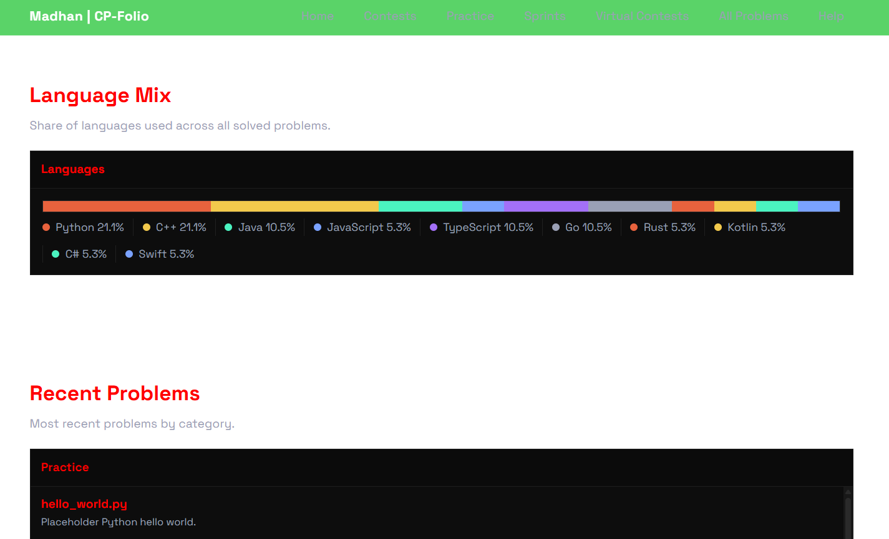
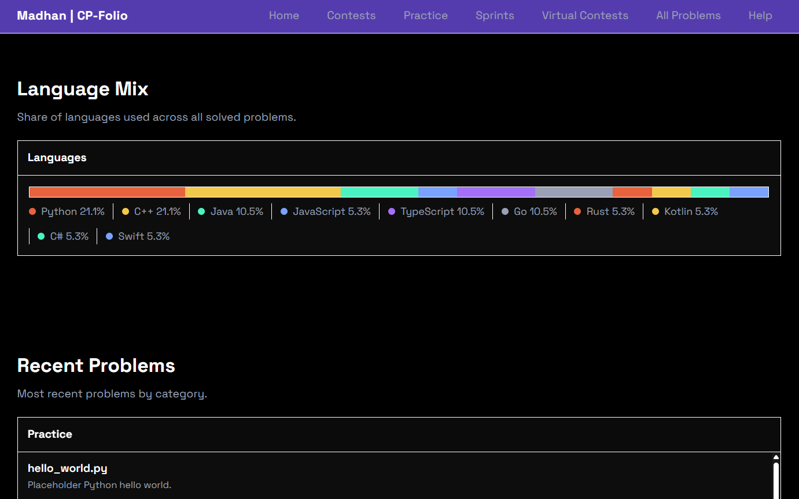

# CP-Folio
Lightweight, static site to browse your competitive programming solutions. Everything is plain HTML/CSS/JS assets; open `index.html` or host as-is.

## What’s inside
- Pages: index + contest/practice/sprint/virtual/all/section pages under `pages/`
- Data: `data/config.json` (name, handle, links)
- Scripts: `scripts/script.js` (lists, search, language badges)
- Styles: `static/style.css` (color variables at the top)
- Code folders: `CP-CODE/` with PRACTISE, CONTESTS, SPRINTS, VIRTUAL-CONTESTS and placeholder files

## Meta files (important)
- Each contest/sprint/virtual folder has a `meta.json`; the site uses these to render titles and summaries. Keep them in place when adding your own files.

## Quick start
1) Fork + clone.
2) Fill `data/config.json` with your info.
3) Swap placeholder files in `CP-CODE/` with your solutions.
4) Update the lists in `scripts/script.js` (practiceList, contestList, sprintList, virtualList) to point to your files.
5) Open `index.html` or run a tiny server (`python -m http.server 8000`) and visit `http://localhost:8000`.

## Visual guide (assets)
- Edit config: 

## Add problems
- Add the files into the `CP-CODE` subfolder as required.
- Add one entry to the matching array in `scripts/script.js` with the path and a short label/snippet.

## Theme
- Tweak the CSS variables at the top of `static/style.css` for colors.
- Tweak colors: 

## Deploy
- Push to GitHub and enable Pages on the main branch; the static assets work without extra setup.
- Deploy on GitHub Pages: 


## Key files (at a glance)
```bash
data/config.json
scripts/script.js
static/style.css
pages/
```

## Default structure
```bash
CP-CODE/
├── PRACTISE/
│   ├── meta.json (keep if you add block-level metadata)
│   └── your_files...
├── CONTESTS/
│   ├── CONTEST-1/
│   │   ├── meta.json
│   │   └── your_files...
│   ├── CONTEST-2/
│   │   ├── meta.json
│   │   └── your_files...
│   └── CONTEST-3/
│       ├── meta.json
│       └── your_files...
├── SPRINTS/
│   ├── SPRINT-BLOCK-1/
│   │   ├── meta.json
│   │   └── your_files...
│   └── SPRINT-BLOCK-2/
│       ├── meta.json
│       └── your_files...
└── VIRTUAL-CONTESTS/
    ├── CONTEST-1/
    │   ├── meta.json
    │   └── your_files...
    ├── CONTEST-2/
    │   ├── meta.json
    │   └── your_files...
    └── CONTEST-3/
        ├── meta.json
        └── your_files...
```
## Customization

You can customize this Static Site Generator into many color palletes
- Default Theme: 
- Customized-1: 
- Customized-2: 